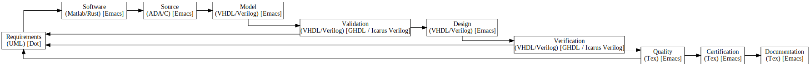
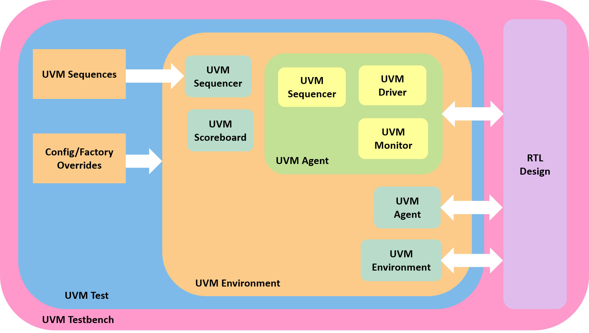

# MPSoC-NTM (T-DNC/NTM-MPSoC)
## QueenField


# 0. INTRODUCTION

A Multi-Processor System on Chip (MPSoC) is a System on Chip (SoC) which includes multiple Processing Units (PU). As such, it is a Multi-Core System-on-Chip. All PUs are linked to each other by a Network on Chip (NoC). These technologies meet the performance needs of multimedia applications, telecommunication architectures or network security.

## 0.1. BEST PRACTICES

### 0.1.1. HARDWARE

```
cd synthesis/yosys
source synthesize.sh
```

#### 0.1.1.1. ASIC

type:
```
cd synthesis/qflow
source flow.sh
```

#### 0.1.1.2. FPGA

type:
```
cd synthesis/symbiflow
source flow.sh
```

### 0.1.2. SOFTWARE

#### 0.1.2.1. MSP430

##### 0.1.2.1.1. MSP430 Tests

##### 0.1.2.1.2. MSP430 Bare Metal

##### 0.1.2.1.3. MSP430 Operating System

###### 0.1.2.1.3.1. GNU Linux

###### 0.1.2.1.3.2. GNU Hurd

##### 0.1.2.1.4. MSP430 Distribution

###### 0.1.2.1.4.1. GNU Debian

###### 0.1.2.1.4.2. GNU Fedora

#### 0.1.2.2. OpenRISC

##### 0.1.2.2.1. OpenRISC Tests

##### 0.1.2.2.2. OpenRISC Bare Metal

##### 0.1.2.2.3. OpenRISC Operating System

###### 0.1.2.2.3.1. GNU Linux

###### 0.1.2.2.3.2. GNU Hurd

##### 0.1.2.2.4. OpenRISC Distribution

###### 0.1.2.2.4.1. GNU Debian

###### 0.1.2.2.4.2. GNU Fedora

#### 0.1.2.3. RISC-V

##### 0.1.2.3.1. RISC-V Tests

type:
```
export PATH=/opt/riscv-elf-gcc/bin:${PATH}

rm -rf tests
rm -rf riscv-tests

mkdir tests
mkdir tests/dump
mkdir tests/hex

git clone --recursive https://github.com/riscv/riscv-tests
cd riscv-tests

autoconf
./configure --prefix=/opt/riscv-elf-gcc/bin
make

cd isa

source ../../elf2hex.sh

mv *.dump ../../tests/dump
mv *.hex ../../tests/hex

cd ..

make clean
```

elf2hex.sh:
```
riscv64-unknown-elf-objcopy -O ihex rv32mi-p-breakpoint rv32mi-p-breakpoint.hex
riscv64-unknown-elf-objcopy -O ihex rv32mi-p-csr rv32mi-p-csr.hex
...
riscv64-unknown-elf-objcopy -O ihex rv64um-v-remw rv64um-v-remw.hex
```

type:
```
export PATH=/opt/riscv-elf-gcc/bin:${PATH}

spike rv32mi-p-breakpoint
spike rv32mi-p-csr
...
spike rv64um-v-remw
```

##### 0.1.2.3.2. RISC-V Bare Metal

type:
```
rm -rf hello_c.elf
rm -rf hello_c.hex

export PATH=/opt/riscv-elf-gcc/bin:${PATH}

riscv64-unknown-elf-gcc -o hello_c.elf hello_c.c
riscv64-unknown-elf-objcopy -O ihex hello_c.elf hello_c.hex
```

C Language:
```c
#include <stdio.h>

int main() {
  printf("Hello QueenField!\n");
  return 0;
}
```

type:
```
export PATH=/opt/riscv-elf-gcc/bin:${PATH}

spike pk hello_c.elf
```

type:
```
rm -rf hello_cpp.elf
rm -rf hello_cpp.hex

export PATH=/opt/riscv-elf-gcc/bin:${PATH}

riscv64-unknown-elf-g++ -o hello_cpp.elf hello_cpp.cpp
riscv64-unknown-elf-objcopy -O ihex hello_cpp.elf hello_cpp.hex
```

C++ Language:
```cpp
#include <iostream>

int main() {
  std::cout << "Hello QueenField!\n";
  return 0;
}
```

type:
```
export PATH=/opt/riscv-elf-gcc/bin:${PATH}

spike pk hello_cpp.elf
```

type:
```
rm -rf hello_go.elf
rm -rf hello_go.hex

export PATH=/opt/riscv-elf-gcc/bin:${PATH}
export PATH=/opt/riscv-go/bin:${PATH}

GOOS=linux GOARCH=riscv64 go build -o hello_go.elf hello_go.go
riscv64-unknown-elf-objcopy -O ihex hello_go.elf hello_go.hex
```

Go Language:
```go
package main

import "fmt"
func main() {
  fmt.Println("Hello QueenField!")
}
```

##### 0.1.2.3.3. RISC-V Operating System

###### 0.1.2.3.3.1. GNU Linux

**Building BusyBox**

type:
```
export PATH=/opt/riscv-elf-gcc/bin:${PATH}

git clone --recursive https://git.busybox.net/busybox

cd busybox
make CROSS_COMPILE=riscv64-unknown-linux-gnu- defconfig
make CROSS_COMPILE=riscv64-unknown-linux-gnu-
```

**Building Linux**

type:
```
export PATH=/opt/riscv-elf-gcc/bin:${PATH}

git clone --recursive https://github.com/torvalds/linux

cd linux
make ARCH=riscv CROSS_COMPILE=riscv64-unknown-linux-gnu- defconfig
make ARCH=riscv CROSS_COMPILE=riscv64-unknown-linux-gnu-
```

**Running Linux**

type:
```
export PATH=/opt/riscv-elf-gcc/bin:${PATH}

qemu-system-riscv64 -nographic -machine virt \
-kernel Image -append "root=/dev/vda ro console=ttyS0" \
-drive file=busybox,format=raw,id=hd0 \
-device virtio-blk-device,drive=hd0
```

**Running Linux RISC-V 32 bit with Buildroot**

type:
```
export PATH=/opt/riscv-elf-gcc/bin:${PATH}

git clone --recursive https://github.com/buildroot/buildroot

cd buildroot
make qemu_riscv32_virt_defconfig
make

qemu-system-riscv32 \
-M virt \
-nographic \
-bios output/images/fw_jump.elf \
-kernel output/images/Image \
-append "root=/dev/vda ro" \
-drive file=output/images/rootfs.ext2,format=raw,id=hd0 \
-device virtio-blk-device,drive=hd0 \
-netdev user,id=net0 \
-device virtio-net-device,netdev=net0
```

**Running Linux RISC-V 64 bit with Buildroot**

type:
```
export PATH=/opt/riscv-elf-gcc/bin:${PATH}

git clone --recursive https://github.com/buildroot/buildroot

cd buildroot
make qemu_riscv64_virt_defconfig
make

qemu-system-riscv64 \
-M virt \
-nographic \
-bios output/images/fw_jump.elf \
-kernel output/images/Image \
-append "root=/dev/vda ro" \
-drive file=output/images/rootfs.ext2,format=raw,id=hd0 \
-device virtio-blk-device,drive=hd0 \
-netdev user,id=net0 \
-device virtio-net-device,netdev=net0
```

###### 0.1.2.3.3.2. GNU Hurd

##### 0.1.2.3.4. RISC-V Distribution

###### 0.1.2.3.4.1. GNU Debian

###### 0.1.2.3.4.2. GNU Fedora

**Running Fedora**

type:
```
export PATH=/opt/riscv-elf-gcc/bin:${PATH}

qemu-system-riscv64 \
-nographic \
-machine virt \
-smp 4 \
-m 2G \
-kernel Fedora-RISCV.elf \
-bios none \
-object rng-random,filename=/dev/urandom,id=rng0 \
-device virtio-rng-device,rng=rng0 \
-device virtio-blk-device,drive=hd0 \
-drive file=Fedora-RISCV.raw,format=raw,id=hd0 \
-device virtio-net-device,netdev=usernet \
-netdev user,id=usernet,hostfwd=tcp::10000-:22
```

## 0.2. OPEN SOURCE PHILOSOPHY

**For Windows Users!**

1. Settings → Apps → Apps & features → Related settings, Programs and Features → Turn Windows features on or off → Windows Subsystem for Linux

2. Microsoft Store → INSTALL UBUNTU

type:
```
sudo apt update
sudo apt upgrade
```

### 0.2.1. Open Source Hardware

#### 0.2.1.1. MSP430 Processing Unit

#### 0.2.1.2. OpenRISC Processing Unit

#### 0.2.1.3. RISC-V Processing Unit

### 0.2.2. Open Source Software

#### 0.2.2.1. MSP430 GNU Compiler Collection

#### 0.2.2.2. OpenRISC GNU Compiler Collection

#### 0.2.2.3. RISC-V GNU Compiler Collection

## 0.3. INSTRUCTION SET ARCHITECTURE

### 0.3.1. RISC-V ISA

#### 0.3.1.1. ISA Bases

##### 0.3.1.1.1. RISC-V 32

##### 0.3.1.1.2. RISC-V 64

##### 0.3.1.1.3. RISC-V 128

#### 0.3.1.2. ISA Extensions

##### 0.3.1.2.1. Base Integer Instruction Set

**RV32I : Base Integer Instruction Set (32 bit)**

| RV32I            |31:25   |24:20 |19:15 |14:12|11:7  |6:0     |
| ---------------- |:------:|:----:|:----:|:---:|:----:|:------:|
| LUI   RD, IMM    |IIIIIII |IIIII |IIIII |III  |RD4:0 |0110111 |
| AUPIC RD, IMM    |IIIIIII |IIIII |IIIII |III  |RD4:0 |0010111 |
| JAL   RD, IMM    |IIIIIII |IIIII |IIIII |III  |RD4:0 |1101111 |
| JALR  RD,RS1,IMM |IIIIIII |IIIII |RS14:0|000  |RD4:0 |1101111 |
| BEQ   RS1,RS2,IMM|IIIIIII |RS24:0|RS14:0|000  |IIIII |1100011 |
| BNE   RS1,RS2,IMM|IIIIIII |RS24:0|RS14:0|001  |IIIII |1100011 |
| BLT   RS1,RS2,IMM|IIIIIII |RS24:0|RS14:0|100  |IIIII |1100011 |
| BGE   RS1,RS2,IMM|IIIIIII |RS24:0|RS14:0|101  |IIIII |1100011 |
| BLTU  RS1,RS2,IMM|IIIIIII |RS24:0|RS14:0|110  |IIIII |1100011 |
| BGEU  RS1,RS2,IMM|IIIIIII |RS24:0|RS14:0|111  |IIIII |1100011 |
| LB    RD, RS1    |IIIIIII |IIIII |RS14:0|000  |RD4:0 |0000011 |
| LH    RD, RS1    |IIIIIII |IIIII |RS14:0|001  |RD4:0 |0000011 |
| LW    RD, RS1    |IIIIIII |IIIII |RS14:0|010  |RD4:0 |0000011 |
| LBU   RD, RS1    |IIIIIII |IIIII |RS14:0|100  |RD4:0 |0000011 |
| LHU   RD, RS1    |IIIIIII |IIIII |RS14:0|101  |RD4:0 |0000011 |
| SB    RS2,RS1    |IIIIIII |RS24:0|RS14:0|000  |IIIII |0100011 |
| SH    RS2,RS1    |IIIIIII |RS24:0|RS14:0|001  |IIIII |0100011 |
| SW    RS2,RS1    |IIIIIII |RS24:0|RS14:0|010  |IIIII |0100011 |
| ADDI  RD,RS1,IMM |IIIIIII |IIIII |RS14:0|000  |RD4:0 |0010011 |
| SLTI  RD,RS1,IMM |IIIIIII |IIIII |RS14:0|010  |RD4:0 |0010011 |
| SLTIU RD,RS1,IMM |IIIIIII |IIIII |RS14:0|011  |RD4:0 |0010011 |
| XORI  RD,RS1,IMM |IIIIIII |IIIII |RS14:0|100  |RD4:0 |0010011 |
| ORI   RD,RS1,IMM |IIIIIII |IIIII |RS14:0|110  |RD4:0 |0010011 |
| ANDI  RD,RS1,IMM |IIIIIII |IIIII |RS14:0|111  |RD4:0 |0010011 |
| SLLI  RD,RS1,IMM |0000000 |IIII  |RS14:0|001  |RD4:0 |0010011 |
| SRLI  RD,RS1,IMM |0000000 |IIII  |RS14:0|101  |RD4:0 |0010011 |
| SRAI  RD,RS1,IMM |0100000 |IIII  |RS14:0|101  |RD4:0 |0010011 |
| ADD   RD,RS1,RS2 |0000000 |RS24:0|RS14:0|000  |RD4:0 |0110011 |
| SUB   RD,RS1,RS2 |0100000 |RS24:0|RS14:0|000  |RD4:0 |0110011 |
| SLL   RD,RS1,RS2 |0000000 |RS24:0|RS14:0|001  |RD4:0 |0110011 |
| SLT   RD,RS1,RS2 |0000000 |RS24:0|RS14:0|010  |RD4:0 |0110011 |
| SLTU  RD,RS1,RS2 |0000000 |RS24:0|RS14:0|011  |RD4:0 |0110011 |
| XOR   RD,RS1,RS2 |0000000 |RS24:0|RS14:0|100  |RD4:0 |0110011 |
| SRL   RD,RS1,RS2 |0000000 |RS24:0|RS14:0|101  |RD4:0 |0110011 |
| SRA   RD,RS1,RS2 |0100000 |RS24:0|RS14:0|101  |RD4:0 |0110011 |
| OR    RD,RS1,RS2 |0000000 |RS24:0|RS14:0|110  |RD4:0 |0110011 |
| AND   RD,RS1,RS2 |0000000 |RS24:0|RS14:0|111  |RD4:0 |0110011 |
| FENCE PRED,SUCC  |0000PPP |PSSSS |00000 |000  |00000 |0001111 |
| FENCE.I          |0000P00 |00000 |00000 |001  |00000 |0001111 |

**RV64I : Base Integer Instruction Set (64 bit)**

| RV64I            |31:25   |24:20 |19:15 |14:12|11:7  |6:0     |
| ---------------- |:------:|:----:|:----:|:---:|:----:|:------:|
|LWU   RD, RS1     |IIIIIII |IIIII |RS14:0|110  |RD4:0 |0000011 |
|LD    RD, RS1     |IIIIIII |IIIII |RS14:0|011  |RD4:0 |0000011 |
|SD    RD, RS1,RS2 |IIIIIII |RS24:0|RS14:0|011  |IIIII |0000011 |
|SLLI  RD, RS1,IMM |0000000 |IIIII |RS14:0|001  |RD4:0 |0010011 |
|SRLI  RD, RS1,IMM |0000000 |IIIII |RS14:0|001  |RD4:0 |0010011 |
|SRAI  RD, RS1,IMM |0100000 |IIIII |RS14:0|001  |RD4:0 |0010011 |
|ADDIW RD, RS1     |IIIIIII |IIIII |RS14:0|000  |RD4:0 |0011011 |
|SLLIW RD, RS1     |0000000 |IIIII |RS14:0|001  |RD4:0 |0011011 |
|SRLIW RD, RS1     |0000000 |IIIII |RS14:0|101  |RD4:0 |0011011 |
|SRAIW RD, RS1     |0100000 |IIIII |RS14:0|101  |RD4:0 |0011011 |
|ADDW  RD, RS1,RS2 |0000000 |RS24:0|RS14:0|000  |RD4:0 |0111011 |
|SUBW  RD, RS1,RS2 |0100000 |RS24:0|RS14:0|000  |RD4:0 |0111011 |
|SLIW  RD, RS1,RS2 |0000000 |RS24:0|RS14:0|001  |RD4:0 |0111011 |
|SRLW  RD, RS1,RS2 |0000000 |RS24:0|RS14:0|101  |RD4:0 |0111011 |
|SRAW  RD, RS1,RS2 |0100000 |RS24:0|RS14:0|101  |RD4:0 |0111011 |

##### 0.3.1.2.2. Standard Extension for Integer Multiply and Divide

**RV32M : Standard Extension for Integer Multiply and Divide (32 bit)**

| RV32M             |31:25   |24:20 |19:15 |14:12|11:7  |6:0     |
| ----------------- |:------:|:----:|:----:|:---:|:----:|:------:|
| MUL RD,RS1,RS2    |0000001 |RS24:0|RS14:0|000  |RD4:0 |0110011 |
| MULH RD,RS1,RS2   |0000001 |RS24:0|RS14:0|001  |RD4:0 |0110011 |
| MULHSU RD,RS1,RS2 |0000001 |RS24:0|RS14:0|010  |RD4:0 |0110011 |
| MULHU RD,RS1,RS2  |0000001 |RS24:0|RS14:0|011  |RD4:0 |0110011 |
| DIV RD,RS1,RS2    |0000001 |RS24:0|RS14:0|100  |RD4:0 |0110011 |
| DIVU RD,RS1,RS2   |0000001 |RS24:0|RS14:0|101  |RD4:0 |0110011 |
| REM RD,RS1,RS2    |0000001 |RS24:0|RS14:0|110  |RD4:0 |0110011 |
| REMU RD,RS1,RS2   |0000001 |RS24:0|RS14:0|111  |RD4:0 |0110011 |

**Standard Extension for Integer Multiply and Divide (64 bit)**

| RV64M             |31:25   |24:20 |19:15 |14:12|11:7  |6:0     |
| ----------------- |:------:|:----:|:----:|:---:|:----:|:------:|
| MULW RD,RS1,RS2   |0000001 |RS24:0|RS14:0|000  |RD4:0 |0111011 |
| DIVW RD,RS1,RS2   |0000001 |RS24:0|RS14:0|100  |RD4:0 |0111011 |
| DIVUW RD,RS1,RS2  |0000001 |RS24:0|RS14:0|101  |RD4:0 |0111011 |
| REMW RD,RS1,RS2   |0000001 |RS24:0|RS14:0|110  |RD4:0 |0111011 |
| REMUW RD,RS1,RS2  |0000001 |RS24:0|RS14:0|111  |RD4:0 |0111011 |

##### 0.3.1.2.3. Standard Extension for Atomic Instructions

**RV32A : Standard Extension for Atomic Instructions (32 bit)**

| RV32A                    |31:25    |24:20 |19:15 |14:12|11:7  |6:0     |
| -------------------------|:-------:|:----:|:----:|:---:|:----:|:------:|
| LR.W AQRL,RD,RS1         |00010AQRL|00000 |RS14:0|010  |RD4:0 |0101111 |
| SC.W AQRL,RD,RS2,RS1     |00011AQRL|RS24:0|RS14:0|010  |RD4:0 |0101111 |
| AMOSWAP.W AQRL,RD,RS2,RS1|00001AQRL|RS24:0|RS14:0|010  |RD4:0 |0101111 |
| AMOSADD.W AQRL,RD,RS2,RS1|00000AQRL|RS24:0|RS14:0|010  |RD4:0 |0101111 |
| AMOSXOR.W AQRL,RD,RS2,RS1|00100AQRL|RS24:0|RS14:0|010  |RD4:0 |0101111 |
| AMOOR.W AQRL,RD,RS2,RS1  |01000AQRL|RS24:0|RS14:0|010  |RD4:0 |0101111 |
| AMOAMD.W AQRL,RD,RS2,RS1 |01100AQRL|RS24:0|RS14:0|010  |RD4:0 |0101111 |
| AMOMIN.W AQRL,RD,RS2,RS1 |10000AQRL|RS24:0|RS14:0|010  |RD4:0 |0101111 |
| AMOMAX.W AQRL,RD,RS2,RS1 |10100AQRL|RS24:0|RS14:0|010  |RD4:0 |0101111 |
| AMOMINU.W AQRL,RD,RS2,RS1|11000AQRL|RS24:0|RS14:0|010  |RD4:0 |0101111 |
| AMOMAXU.W AQRL,RD,RS2,RS1|11100AQRL|RS24:0|RS14:0|010  |RD4:0 |0101111 |

**RV64A : Standard Extension for Atomic Instructions (64 bit)**

| RV64A                    |31:25    |24:20 |19:15 |14:12|11:7  |6:0     |
| -------------------------|:-------:|:----:|:----:|:---:|:----:|:------:|
| LR.D AQRL,RD,RS1         |00010AQRL|00000 |RS14:0|011  |RD4:0 |0101111 |
| SC.D AQRL,RD,RS2,RS1     |00011AQRL|RS24:0|RS14:0|011  |RD4:0 |0101111 |
| AMOSWAP.D AQRL,RD,RS2,RS1|00001AQRL|RS24:0|RS14:0|011  |RD4:0 |0101111 |
| AMOSADD.D AQRL,RD,RS2,RS1|00000AQRL|RS24:0|RS14:0|011  |RD4:0 |0101111 |
| AMOSXOR.D AQRL,RD,RS2,RS1|00100AQRL|RS24:0|RS14:0|011  |RD4:0 |0101111 |
| AMOOR.D AQRL,RD,RS2,RS1  |01000AQRL|RS24:0|RS14:0|011  |RD4:0 |0101111 |
| AMOAMD.D AQRL,RD,RS2,RS1 |01100AQRL|RS24:0|RS14:0|011  |RD4:0 |0101111 |
| AMOMIN.D AQRL,RD,RS2,RS1 |10000AQRL|RS24:0|RS14:0|011  |RD4:0 |0101111 |
| AMOMAX.D AQRL,RD,RS2,RS1 |10100AQRL|RS24:0|RS14:0|011  |RD4:0 |0101111 |
| AMOMINU.D AQRL,RD,RS2,RS1|11000AQRL|RS24:0|RS14:0|011  |RD4:0 |0101111 |
| AMOMAXU.D AQRL,RD,RS2,RS1|11100AQRL|RS24:0|RS14:0|011  |RD4:0 |0101111 |

##### 0.3.1.2.4. Standard Extension for Single-Precision Floating-Point

**RV32F : Standard Extension for Single-Precision Floating-Point (32 bit)**

| RV32F                         |31:25    |24:20 |19:15 |14:12|11:7  |6:0     |
| ------------------------------|:-------:|:----:|:----:|:---:|:----:|:------:|
| FLW FRD,RS1                   |IIIIIII  |IIIII |FRS1  |010  |FRD   |0000111 |
| FSW FRS2,RS1                  |IIIIIII  |FRS2  |FRS1  |010  |IIIII |0100111 |
| FMADD.S RM,FRD,FRS1,FRS2,FRS3 |FRS3_00  |FRS2  |FRS1  |RM   |FRD   |1000011 |
| FMSUB.S RM,FRD,FRS1,FRS2,FRS3 |FRS3_00  |FRS2  |FRS1  |RM   |FRD   |1000111 |
| FNMSUB.S RM,FRD,FRS1,FRS2,FRS3|FRS3_00  |FRS2  |FRS1  |RM   |FRD   |1001011 |
| FNMADD.S RM,FRD,FRS1,FRS2,FRS3|FRS3_00  |FRS2  |FRS1  |RM   |FRD   |1001111 |
| FADD.S RM,FRD,FRS1,FRS2,FRS3  |0000000  |FRS2  |FRS1  |RM   |FRD   |1010011 |
| FSUB.S RM,FRD,FRS1,FRS2,FRS3  |0000100  |FRS2  |FRS1  |RM   |FRD   |1010011 |
| FMUL.S RM,FRD,FRS1,FRS2,FRS3  |0001000  |FRS2  |FRS1  |RM   |FRD   |1010011 |
| FDIV.S RM,FRD,FRS1,FRS2,FRS3  |0001100  |FRS2  |FRS1  |RM   |FRD   |1010011 |
| FSGNJ.S FRD,FRS1,FRS2         |0010000  |FRS2  |FRS1  |000  |FRD   |1010011 |
| FSGNJN.S FRD,FRS1,FRS2        |0010000  |FRS2  |FRS1  |001  |FRD   |1010011 |
| FSGNJX.S FRD,FRS1,FRS2        |0010000  |FRS2  |FRS1  |010  |FRD   |1010011 |
| FMIN.S FRD,FRS1,FRS2          |0010100  |FRS2  |FRS1  |000  |FRD   |1010011 |
| FMAX.S FRD,FRS1,FRS2          |0010100  |FRS2  |FRS1  |001  |FRD   |1010011 |
| FSQRT.S FRD,FRS1,FRS2         |0101100  |00000 |FRS1  |RM   |FRD   |1010011 |
| FLE.S FRD,FRS1,FRS2           |1010000  |FRS2  |FRS1  |000  |FRD   |1010011 |
| FLT.S FRD,FRS1,FRS2           |1010000  |FRS2  |FRS1  |001  |FRD   |1010011 |
| FEQ.S FRD,FRS1,FRS2           |1010000  |FRS2  |FRS1  |010  |FRD   |1010011 |
| FCVT.W.S RM,RD,FRS1           |1100000  |00000 |FRS1  |RM   |FRD   |1010011 |
| FCVT.WU.S RM,RD,FRS1          |1100000  |00010 |FRS1  |RM   |FRD   |1010011 |
| FCVT.S.W RM,RD,FRS1           |1101000  |00000 |FRS1  |RM   |FRD   |1010011 |
| FCVT.S.WU RM,RD,FRS1          |1101000  |00010 |FRS1  |RM   |FRD   |1010011 |
| FMV.X.S RD,FRS1               |1110000  |00000 |FRS1  |000  |RD    |1010011 |
| FCLASS.S RD,FRS1              |1110000  |00000 |FRS1  |001  |RD    |1010011 |
| FMV.S.X RD,FRS1               |1111000  |00000 |RS1   |000  |FRD   |1010011 |

**RV64F : Standard Extension for Single-Precision Floating-Point (64 bit)**

| RV64F                         |31:25    |24:20 |19:15 |14:12|11:7  |6:0     |
| ------------------------------|:-------:|:----:|:----:|:---:|:----:|:------:|
| FCVT.L.S RM,RD,FRS1           |1100000  |00010 |FRS1  |RM   |FRD   |1010011 |
| FCVT.LU.S RM,RD,FRS1          |1100000  |00011 |FRS1  |RM   |FRD   |1010011 |
| FCVT.S.L RM,RD,FRS1           |1101000  |00010 |FRS1  |RM   |FRD   |1010011 |
| FCVT.S.LU RM,RD,FRS1          |1101000  |00011 |FRS1  |RM   |FRD   |1010011 |

##### 0.3.1.2.5. Standard Extension for Double-Precision Floating-Point

**RV32D : Standard Extension for Double-Precision Floating-Point (32 bit)**

| RV32F                         |31:25    |24:20 |19:15 |14:12|11:7  |6:0     |
| ------------------------------|:-------:|:----:|:----:|:---:|:----:|:------:|
| FLW FRD,RS1                   |IIIIIII  |IIIII |FRS1  |011  |FRD   |0000111 |
| FSW FRS2,RS1                  |IIIIIII  |FRS2  |FRS1  |011  |IIIII |0100111 |
| FMADD.D RM,FRD,FRS1,FRS2,FRS3 |FRS3_01  |FRS2  |FRS1  |RM   |FRD   |1000011 |
| FMSUB.D RM,FRD,FRS1,FRS2,FRS3 |FRS3_01  |FRS2  |FRS1  |RM   |FRD   |1000111 |
| FNMSUB.D RM,FRD,FRS1,FRS2,FRS3|FRS3_01  |FRS2  |FRS1  |RM   |FRD   |1001011 |
| FNMADD.D RM,FRD,FRS1,FRS2,FRS3|FRS3_01  |FRS2  |FRS1  |RM   |FRD   |1001111 |
| FADD.D RM,FRD,FRS1,FRS2,FRS3  |0000001  |FRS2  |FRS1  |RM   |FRD   |1010011 |
| FSUB.D RM,FRD,FRS1,FRS2,FRS3  |0000101  |FRS2  |FRS1  |RM   |FRD   |1010011 |
| FMUL.D RM,FRD,FRS1,FRS2,FRS3  |0001001  |FRS2  |FRS1  |RM   |FRD   |1010011 |
| FDIV.D RM,FRD,FRS1,FRS2,FRS3  |0001101  |FRS2  |FRS1  |RM   |FRD   |1010011 |
| FSGNJ.D FRD,FRS1,FRS2         |0010001  |FRS2  |FRS1  |000  |FRD   |1010011 |
| FSGNJN.D FRD,FRS1,FRS2        |0010001  |FRS2  |FRS1  |001  |FRD   |1010011 |
| FSGNJX.D FRD,FRS1,FRS2        |0010001  |FRS2  |FRS1  |010  |FRD   |1010011 |
| FMIN.D FRD,FRS1,FRS2          |0010101  |FRS2  |FRS1  |000  |FRD   |1010011 |
| FMAX.D FRD,FRS1,FRS2          |0010101  |FRS2  |FRS1  |001  |FRD   |1010011 |
| FSQRT.D FRD,FRS1,FRS2         |0101101  |00000 |FRS1  |RM   |FRD   |1010011 |
| FLE.D FRD,FRS1,FRS2           |1010001  |FRS2  |FRS1  |000  |FRD   |1010011 |
| FLT.D FRD,FRS1,FRS2           |1010001  |FRS2  |FRS1  |001  |FRD   |1010011 |
| FEQ.D FRD,FRS1,FRS2           |1010001  |FRS2  |FRS1  |010  |FRD   |1010011 |
| FCVT.W.D RM,RD,FRS1           |1100001  |00000 |FRS1  |RM   |FRD   |1010011 |
| FCVT.WU.D RM,RD,FRS1          |1100001  |00010 |FRS1  |RM   |FRD   |1010011 |
| FCVT.D.W RM,RD,FRS1           |1101001  |00000 |FRS1  |RM   |FRD   |1010011 |
| FCVT.D.WU RM,RD,FRS1          |1101001  |00010 |FRS1  |RM   |FRD   |1010011 |
| FCLASS.D RD,FRS1              |1110001  |00000 |FRS1  |001  |RD    |1010011 |

**RV64D : Standard Extension for Double-Precision Floating-Point (64 bit)**

| RV64D                         |31:25    |24:20 |19:15 |14:12|11:7  |6:0     |
| ------------------------------|:-------:|:----:|:----:|:---:|:----:|:------:|
| FCVT.L.D RM,RD,FRS1           |1100001  |00010 |FRS1  |RM   |FRD   |1010011 |
| FCVT.LU.D RM,RD,FRS1          |1100001  |00011 |FRS1  |RM   |FRD   |1010011 |
| FCVT.D.L RM,RD,FRS1           |1101001  |00010 |FRS1  |RM   |FRD   |1010011 |
| FCVT.D.LU RM,RD,FRS1          |1101001  |00011 |FRS1  |RM   |FRD   |1010011 |
| FMV.X.D RD,FRS1               |1110001  |00000 |FRS1  |000  |RD    |1010011 |
| FMV.D.X RD,FRS1               |1111001  |00000 |RS1   |000  |FRD   |1010011 |

#### 0.3.1.3. ISA Modes

##### 0.3.1.3.1. RISC-V User

##### 0.3.1.3.2. RISC-V Supervisor

##### 0.3.1.3.3. RISC-V Hypervisor

##### 0.3.1.3.4. RISC-V Machine

### 0.3.2. OpenRISC ISA

#### 0.3.2.1. ISA Bases

##### 0.3.2.2.1. OpenRISC 32

##### 0.3.2.2.2. OpenRISC 64

##### 0.3.2.2.3. OpenRISC 128

#### 0.3.2.2. ISA Extensions

#### 0.3.2.3. ISA Modes

##### 0.3.2.3.1. OpenRISC User

##### 0.3.2.3.2. OpenRISC Supervisor

##### 0.3.2.3.3. OpenRISC Hypervisor

##### 0.3.2.3.4. OpenRISC Machine

### 0.3.3. MSP430 ISA

#### 0.3.3.1. ISA Bases

##### 0.3.3.2.1. MSP430 32

##### 0.3.3.2.2. MSP430 64

##### 0.3.3.2.3. MSP430 128

#### 0.3.3.2. ISA Extensions

#### 0.3.3.3. ISA Modes

##### 0.3.3.3.1. MSP430 User

##### 0.3.3.3.2. MSP430 Supervisor

##### 0.3.3.3.3. MSP430 Hypervisor

##### 0.3.3.3.4. MSP430 Machine

# 1. METHODOLOGY



* CONTROL
  - certification
  - doc
  - quality
  - requirements

* DEVELOP
  - bench
  - model
  - osvvm/uvm
  - rtl
  - software
  - src

* OPERATION
  - sim
  - compilation/synthesis

## 1.1. Requirements


### 1.1.1. Structural UML diagrams

#### 1.1.1.1. Class diagram
#### 1.1.1.2. Component diagram
#### 1.1.1.3. Composite diagram
#### 1.1.1.4. Deployment diagram
#### 1.1.1.5. Object diagram
#### 1.1.1.6. Package diagram
#### 1.1.1.7. Profile diagram

### 1.1.2. Behavioral UML diagrams

#### 1.1.2.1. Activity diagram
#### 1.1.2.2. Communication diagram
#### 1.1.2.3. Interaction diagram
#### 1.1.2.4. Sequence diagram
#### 1.1.2.5. State diagram
#### 1.1.2.6. Timing diagram
#### 1.1.2.7. Use diagram

## 1.2. Software

### 1.2.1. Matlab Language
### 1.2.1. Rust Language

## 1.3. Source

### 1.3.1. Ada Language
### 1.3.2. C Language

## 1.4. Model

### 1.4.1. VHDL Language
### 1.4.2. Verilog Language

## 1.5. Validation

### 1.5.1. VHDL Language
### 1.5.2. Verilog Language

## 1.6. Design

### 1.6.1. VHDL Language
### 1.6.2. Verilog Language

## 1.7. Verification

### 1.7.1. OSVVM-VHDL

#### 1.7.1.1. OSVVM Checker
#### 1.7.1.2. OSVVM Stimulus
#### 1.7.1.3. OSVVM Testbench

### 1.7.2. UVM-Verilog



#### 1.7.2.1. UVM Agent
#### 1.7.2.2. UVM Driver
#### 1.7.2.3. UVM Enviroment
#### 1.7.2.4. UVM Monitor
#### 1.7.2.5. UVM Scoreboard
#### 1.7.2.6. UVM Sequence
#### 1.7.2.7. UVM Sequencer
#### 1.7.2.8. UVM Subscriber
#### 1.7.2.9. UVM Test
#### 1.7.2.10. UVM Testbench
#### 1.7.2.11. UVM Transaction

## 1.8. Quality
## 1.9. Certification
## 1.10. Documentation

# 2. PROJECTS

## 2.1. INTERFACE

### 2.1.1. INSTRUCTION CACHE

#### 2.1.1.1 Instruction Inputs/Outputs AMBA4 AXI-Lite Bus

##### 2.1.1.1.1. Signals of the Read and Write Address channels

| Write Port | Read Port  |  Size            | Direction | Description                              |
| ---------- | ---------- | ---------------- | --------- | ---------------------------------------- |
| `AWID`     | `ARID`     | `AXI_ID_WIDTH`   | Output    | Address ID, to identify multiple streams |
| `AWADDR`   | `ARADDR`   | `AXI_ADDR_WIDTH` | Output    | Address of the first beat of the burst   |
| `AWLEN`    | `ARLEN`    |         8        | Output    | Number of beats inside the burst         |
| `AWSIZE`   | `ARSIZE`   |         3        | Output    | Size of each beat                        |
| `AWBURST`  | `ARBURST`  |         2        | Output    | Type of the burst                        |
| `AWLOCK`   | `ARLOCK`   |         1        | Output    | Lock type, to provide atomic operations  |
| `AWCACHE`  | `ARCACHE`  |         4        | Output    | Memory type, progress through the system |
| `AWPROT`   | `ARPROT`   |         3        | Output    | Protection type                          |
| `AWQOS`    | `ARQOS`    |         4        | Output    | Quality of Service of the transaction    |
| `AWREGION` | `ARREGION` |         4        | Output    | Region identifier, physical to logical   |
| `AWUSER`   | `ARUSER`   | `AXI_USER_WIDTH` | Output    | User-defined data                        |
| `AWVALID`  | `ARVALID`  |         1        | Output    | xVALID handshake signal                  |
| `AWREADY`  | `ARREADY`  |         1        | Input     | xREADY handshake signal                  |

##### 2.1.1.1.2. Signals of the Read and Write Data channels

| Write Port | Read Port  |  Size            | Direction | Description                              |
| ---------- | ---------- | ---------------- | --------- | ---------------------------------------- |
| `WID`      | `RID`      | `AXI_ID_WIDTH`   | Output    | Data ID, to identify multiple streams    |
| `WDATA`    | `RDATA`    | `AXI_DATA_WIDTH` | Output    | Read/Write data                          |
|    `--`    | `RRESP`    |        2         | Output    | Read response, current RDATA status      |
| `WSTRB`    |    `--`    | `AXI_STRB_WIDTH` | Output    | Byte strobe, WDATA signal                |
| `WLAST`    | `RLAST`    |        1         | Output    | Last beat identifier                     |
| `WUSER`    | `RUSER`    | `AXI_USER_WIDTH` | Output    | User-defined data                        |
| `WVALID`   | `RVALID`   |        1         | Output    | xVALID handshake signal                  |
| `WREADY`   | `RREADY`   |        1         | Input     | xREADY handshake signal                  |

##### 2.1.1.1.3. Signals of the Write Response channel

| Write Port | Size             | Direction | Description                                     |
| ---------- | ---------------- | --------- | ----------------------------------------------- |
| `BID`      | `AXI_ID_WIDTH`   |   Input   | Write response ID, to identify multiple streams |
| `BRESP`    |         2        |   Input   | Write response, to specify the burst status     |
| `BUSER`    | `AXI_USER_WIDTH` |   Input   | User-defined data                               |
| `BVALID`   |         1        |   Input   | xVALID handshake signal                         |
| `BREADY`   |         1        |   Output  | xREADY handshake signal                         |

#### 2.1.1.2. Instruction Inputs/Outputs AMBA3 AHB-Lite Bus

| Port         |  Size  | Direction | Description                           |
| ------------ | ------ | --------- | ------------------------------------- |
| `HRESETn`    |    1   |   Input   | Asynchronous Active Low Reset         |
| `HCLK`       |    1   |   Input   | System Clock Input                    |
|              |        |           |                                       |
| `IHSEL`      |    1   |   Output  | Instruction Bus Select                |
| `IHADDR`     | `PLEN` |   Output  | Instruction Address Bus               |
| `IHRDATA`    | `XLEN` |   Input   | Instruction Read Data Bus             |
| `IHWDATA`    | `XLEN` |   Output  | Instruction Write Data Bus            |
| `IHWRITE`    |    1   |   Output  | Instruction Write Select              |
| `IHSIZE`     |    3   |   Output  | Instruction Transfer Size             |
| `IHBURST`    |    3   |   Output  | Instruction Transfer Burst Size       |
| `IHPROT`     |    4   |   Output  | Instruction Transfer Protection Level |
| `IHTRANS`    |    2   |   Output  | Instruction Transfer Type             |
| `IHMASTLOCK` |    1   |   Output  | Instruction Transfer Master Lock      |
| `IHREADY`    |    1   |   Input   | Instruction Slave Ready Indicator     |
| `IHRESP`     |    1   |   Input   | Instruction Transfer Response         |

#### 2.1.1.3. Instruction Inputs/Outputs Wishbone Bus

| Port    |  Size  | Direction | Description                     |
| ------- | ------ | --------- | ------------------------------- |
| `rst`   |    1   |   Input   | Synchronous Active High Reset   |
| `clk`   |    1   |   Input   | System Clock Input              |
|         |        |           |                                 |
| `iadr`  |  `AW`  |   Input   | Instruction Address Bus         |
| `idati` |  `DW`  |   Input   | Instruction Input Bus           |
| `idato` |  `DW`  |   Output  | Instruction Output Bus          |
| `isel`  | `DW/8` |   Input   | Byte Select Signals             |
| `iwe`   |    1   |   Input   | Write Enable Input              |
| `istb`  |    1   |   Input   | Strobe Signal/Core Select Input |
| `icyc`  |    1   |   Input   | Valid Bus Cycle Input           |
| `iack`  |    1   |   Output  | Bus Cycle Acknowledge Output    |
| `ierr`  |    1   |   Output  | Bus Cycle Error Output          |
| `iint`  |    1   |   Output  | Interrupt Signal Output         |

### 2.1.2. DATA CACHE

#### 2.1.2.1. Data Inputs/Outputs AMBA4 AXI-Lite Bus

##### 2.1.2.1.1. Signals of the Read and Write Address channels

| Write Port | Read Port  |  Size            | Direction | Description                              |
| ---------- | ---------- | ---------------- | --------- | ---------------------------------------- |
| `AWID`     | `ARID`     | `AXI_ID_WIDTH`   | Output    | Address ID, to identify multiple streams |
| `AWADDR`   | `ARADDR`   | `AXI_ADDR_WIDTH` | Output    | Address of the first beat of the burst   |
| `AWLEN`    | `ARLEN`    |         8        | Output    | Number of beats inside the burst         |
| `AWSIZE`   | `ARSIZE`   |         3        | Output    | Size of each beat                        |
| `AWBURST`  | `ARBURST`  |         2        | Output    | Type of the burst                        |
| `AWLOCK`   | `ARLOCK`   |         1        | Output    | Lock type, to provide atomic operations  |
| `AWCACHE`  | `ARCACHE`  |         4        | Output    | Memory type, progress through the system |
| `AWPROT`   | `ARPROT`   |         3        | Output    | Protection type                          |
| `AWQOS`    | `ARQOS`    |         4        | Output    | Quality of Service of the transaction    |
| `AWREGION` | `ARREGION` |         4        | Output    | Region identifier, physical to logical   |
| `AWUSER`   | `ARUSER`   | `AXI_USER_WIDTH` | Output    | User-defined data                        |
| `AWVALID`  | `ARVALID`  |         1        | Output    | xVALID handshake signal                  |
| `AWREADY`  | `ARREADY`  |         1        | Input     | xREADY handshake signal                  |

##### 2.1.2.1.2. Signals of the Read and Write Data channels

| Write Port | Read Port  |  Size            | Direction | Description                              |
| ---------- | ---------- | ---------------- | --------- | ---------------------------------------- |
| `WID`      | `RID`      | `AXI_ID_WIDTH`   | Output    | Data ID, to identify multiple streams    |
| `WDATA`    | `RDATA`    | `AXI_DATA_WIDTH` | Output    | Read/Write data                          |
|    `--`    | `RRESP`    |        2         | Output    | Read response, current RDATA status      |
| `WSTRB`    |    `--`    | `AXI_STRB_WIDTH` | Output    | Byte strobe, WDATA signal                |
| `WLAST`    | `RLAST`    |        1         | Output    | Last beat identifier                     |
| `WUSER`    | `RUSER`    | `AXI_USER_WIDTH` | Output    | User-defined data                        |
| `WVALID`   | `RVALID`   |        1         | Output    | xVALID handshake signal                  |
| `WREADY`   | `RREADY`   |        1         | Input     | xREADY handshake signal                  |

##### 2.1.2.1.3. Signals of the Write Response channel

| Write Port | Size             | Direction | Description                                     |
| ---------- | ---------------- | --------- | ----------------------------------------------- |
| `BID`      | `AXI_ID_WIDTH`   |   Input   | Write response ID, to identify multiple streams |
| `BRESP`    |         2        |   Input   | Write response, to specify the burst status     |
| `BUSER`    | `AXI_USER_WIDTH` |   Input   | User-defined data                               |
| `BVALID`   |         1        |   Input   | xVALID handshake signal                         |
| `BREADY`   |         1        |   Output  | xREADY handshake signal                         |

#### 2.1.2.2. Data Inputs/Outputs AMBA3 AHB-Lite Bus

| Port         |  Size  | Direction | Description                    |
| ------------ | ------ | --------- | ------------------------------ |
| `HRESETn`    |    1   |   Input   | Asynchronous Active Low Reset  |
| `HCLK`       |    1   |   Input   | System Clock Input             |
|              |        |           |                                |
| `DHSEL`      |    1   |   Output  | Data Bus Select                |
| `DHADDR`     | `PLEN` |   Output  | Data Address Bus               |
| `DHRDATA`    | `XLEN` |   Input   | Data Read Data Bus             |
| `DHWDATA`    | `XLEN` |   Output  | Data Write Data Bus            |
| `DHWRITE`    |    1   |   Output  | Data Write Select              |
| `DHSIZE`     |    3   |   Output  | Data Transfer Size             |
| `DHBURST`    |    3   |   Output  | Data Transfer Burst Size       |
| `DHPROT`     |    4   |   Output  | Data Transfer Protection Level |
| `DHTRANS`    |    2   |   Output  | Data Transfer Type             |
| `DHMASTLOCK` |    1   |   Output  | Data Transfer Master Lock      |
| `DHREADY`    |    1   |   Input   | Data Slave Ready Indicator     |
| `DHRESP`     |    1   |   Input   | Data Transfer Response         |

#### 2.1.2.3. Data Inputs/Outputs Wishbone Bus

| Port    |  Size  | Direction | Description                     |
| ------- | ------ | --------- | ------------------------------- |
| `rst`   |    1   |   Input   | Synchronous Active High Reset   |
| `clk`   |    1   |   Input   | System Clock Input              |
|         |        |           |                                 |
| `dadr`  |  `AW`  |   Input   | Data Address Bus                |
| `ddati` |  `DW`  |   Input   | Data Input Bus                  |
| `ddato` |  `DW`  |   Output  | Data Output Bus                 |
| `dsel`  | `DW/8` |   Input   | Byte Select Signals             |
| `dwe`   |    1   |   Input   | Write Enable Input              |
| `dstb`  |    1   |   Input   | Strobe Signal/Core Select Input |
| `dcyc`  |    1   |   Input   | Valid Bus Cycle Input           |
| `dack`  |    1   |   Output  | Bus Cycle Acknowledge Output    |
| `derr`  |    1   |   Output  | Bus Cycle Error Output          |
| `dint`  |    1   |   Output  | Interrupt Signal Output         |

## 2.2. FUNCTIONALITY

### 2.2.1. Structure

#### 2.2.1.1. Traditional Computing Classes

```cpp
class traditional_classes {
   private:
      int number_pu;
      int number_soc;
      int number_mpsoc;

   public:
      void traditional_method_0();  // method 0
      void traditional_method_1();  // method 1
      void traditional_method_2();  // method 2
      void traditional_method_3();  // method 3
};
```

##### 2.2.1.1.1. Philosophers Traditional T-DNC/NTM-MPSoC

```cpp
class traditional_philosophers : private traditional_classes {
   private:
      int number_p_pu;
      int number_p_soc;
      int number_p_mpsoc;

   public:
      void traditional_method_p0();  // method 0
      void traditional_method_p1();  // method 1
      void traditional_method_p2();  // method 2
      void traditional_method_p3();  // method 3
};
```

###### 2.2.1.1.1.1. PU-NTM

###### 2.2.1.1.1.2. SoC-NTM

###### 2.2.1.1.1.3. MPSoC-NTM

##### 2.2.1.1.2. Soldiers Traditional T-DNC/NTM-MPSoC

```cpp
class traditional_soldiers : private traditional_classes {
   private:
      int number_s_pu;
      int number_s_soc;
      int number_s_mpsoc;

   public:
      void traditional_method_s0();  // method 0
      void traditional_method_s1();  // method 1
      void traditional_method_s2();  // method 2
      void traditional_method_s3();  // method 3
};
```

###### 2.2.1.1.2.1. PU-NTM

###### 2.2.1.1.2.2. SoC-NTM

###### 2.2.1.1.2.3. MPSoC-NTM

##### 2.2.1.1.3. Workers Traditional T-DNC/NTM-MPSoC

```cpp
class traditional_workers : private traditional_classes {
   private:
      int number_w_pu;
      int number_w_soc;
      int number_w_mpsoc;

   public:
      void traditional_method_w0();  // method 0
      void traditional_method_w1();  // method 1
      void traditional_method_w2();  // method 2
      void traditional_method_w3();  // method 3
};
```

###### 2.2.1.1.3.1. PU-NTM

###### 2.2.1.1.3.2. SoC-NTM

###### 2.2.1.1.3.3. MPSoC-NTM

### 2.2.2. Behavior

## 2.3. REGISTERS

## 2.4. INTERRUPTIONS

# 3. ORGANIZATION

## 3.1. TRADITIONAL COMPUTING

### 3.1.1. Traditional Mechanics

#### 3.1.1.1. Postulate I

#### 3.1.1.2. Postulate II

#### 3.1.1.3. Postulate III

#### 3.1.1.4. Postulate IV

#### 3.1.1.5. Postulate V

#### 3.1.1.6. Postulate VI

### 3.1.2. Traditional Information

#### 3.1.2.1. Traditional Bit

#### 3.1.2.2. Traditional Logic Gate

##### 3.1.2.2.1. Traditional YES/NOT Gate

##### 3.1.2.2.2. Traditional AND/NAND Gate

##### 3.1.2.2.3. Traditional OR/NOR Gate

##### 3.1.2.2.4. Traditional XOR/XNOR Gate

#### 3.1.2.3. Traditional Combinational Logic

##### 3.1.2.3.1. Traditional Arithmetic Circuits

##### 3.1.2.3.2. Traditional Logic Circuits

#### 3.1.2.4. Traditional Finite State Machine

#### 3.1.2.5. Traditional Pushdown Automaton

### 3.1.3. Traditional Neural Network

#### 3.1.3.1. Traditional Feedforward Neural Network

#### 3.1.3.2. Traditional Long Short Term Memory Neural Network

#### 3.1.3.3. Traditional Transformer Neural Network

### 3.1.4. Traditional Turing Machine

#### 3.1.4.1. Traditional Neural Turing Machine

##### 3.1.4.1.1. Traditional Feedforward Neural Turing Machine

##### 3.1.4.1.2. Traditional LSTM Neural Turing Machine

##### 3.1.4.1.3. Traditional Transformer Neural Turing Machine

#### 3.1.4.2. Traditional Differentiable Neural Computer

##### 3.1.4.2.1. Traditional Feedforward Differentiable Neural Computer

##### 3.1.4.2.2. Traditional LSTM Differentiable Neural Computer

##### 3.1.4.2.3. Traditional Transformer Differentiable Neural Computer

### 3.1.5. Traditional Computer Architecture

#### 3.1.5.1. Traditional von Neumann Architecture

##### 3.1.5.1.1. Traditional Control Unit

##### 3.1.5.1.2. Traditional ALU

##### 3.1.5.1.3. Traditional Memory Unit

##### 3.1.5.1.4. Traditional I/O Unit

#### 3.1.5.2. Traditional Harvard Architecture

##### 3.1.5.2.1. Traditional Control Unit

##### 3.1.5.2.2. Traditional ALU

##### 3.1.5.2.3.Traditional Memory Unit

##### 3.1.5.2.4.Traditional I/O Unit

### 3.1.6. Traditional Advanced Computer Architecture

#### 3.1.6.1. Traditional Processing Unit

##### 3.1.6.1.1. Traditional SISD

##### 3.1.6.1.2. Traditional SIMD

##### 3.1.6.1.3. Traditional MISD

##### 3.1.6.1.4. Traditional MIMD

#### 3.1.6.2. Traditional System on Chip

##### 3.1.6.2.1. Traditional Bus on Chip

##### 3.1.6.2.2. Traditional Network on Chip

#### 3.1.6.3. Traditional Multi-Processor System on Chip

# 4. HARDWARE WORKFLOW

**1. System Level (SystemC/SystemVerilog)**

The System Level abstraction of a system only looks at its biggest building blocks like processing units or peripheral devices. At this level the circuit is usually described using traditional programming languages like SystemC or SystemVerilog. Sometimes special software libraries are used that are aimed at simulation circuits on the system level. The IEEE 1685-2009 standard defines the IP-XACT file format that can be used to represent designs on the system level and building blocks that can be used in such system level designs.

**2. Behavioral & Register Transfer Level (VHDL/Verilog)**

At the Behavioural Level abstraction a language aimed at hardware description such as Verilog or VHDL is used to describe the circuit, but so-called behavioural modeling is used in at least part of the circuit description. In behavioural modeling there must be a language feature that allows for imperative programming to be used to describe data paths and registers. This is the always -block in Verilog and the process -block in VHDL.

A design in Register Transfer Level representation is usually stored using HDLs like Verilog and VHDL. But only a very limited subset of features is used, namely minimalistic always blocks (Verilog) or process blocks (VHDL) that model the register type used and unconditional assignments for the datapath logic. The use of HDLs on this level simplifies simulation as no additional tools are required to simulate a design in Register Transfer Level representation.

**3. Logical Gate**

At the Logical Gate Level the design is represented by a netlist that uses only cells from a small number of single-bit cells, such as basic logic gates (AND, OR, NOT, XOR, etc.) and registers (usually D-Type Flip-flops). A number of netlist formats exists that can be used on this level such as the Electronic Design Interchange Format (EDIF), but for ease of simulation often a HDL netlist is used. The latter is a HDL file (Verilog or VHDL) that only uses the most basic language constructs for instantiation and connecting of cells.

**4. Physical Gate**

On the Physical Gate Level only gates are used that are physically available on the target architecture. In some cases this may only be NAND, NOR and NOT gates as well as D-Type registers. In the case of an FPGA-based design the Physical Gate Level representation is a netlist of LUTs with optional output registers, as these are the basic building blocks of FPGA logic cells.

**5. Switch Level**

A Switch Level representation of a circuit is a netlist utilizing single transistors as cells. Switch Level modeling is possible in Verilog and VHDL, but is seldom used in modern designs, as in modern digital ASIC or FPGA flows the physical gates are considered the atomic build blocks of the logic circuit.

1. Settings → Apps → Apps & features → Related settings, Programs and
Features → Turn Windows features on or off → Windows Subsystem for
Linux

2. Microsoft Store → INSTALL UBUNTU

Front-End and Back-End Library
type:
```
sudo apt update
sudo apt upgrade

sudo apt install bison cmake flex freeglut3-dev libcairo2-dev libgsl-dev \
libncurses-dev libx11-dev m4 python-tk python3-tk swig tcl tcl-dev tk-dev tcsh
```

Synthesizer Library
type:
```
sudo apt update
sudo apt upgrade
```

```
sudo apt -y install build-essential clang bison flex \
libreadline-dev gawk tcl-dev libffi-dev git make gnat \
graphviz xdot pkg-config python3 libboost-system-dev \
libboost-python-dev libboost-filesystem-dev zlib1g-dev
```

## 4.1. FRONT-END OPEN SOURCE TOOLS


### 4.1.1. Modeling System Level of Hardware

*A System Description Language Editor is a computer tool that allows to generate software code. A System Description Language is a formal language, which comprises a Programming Language (input), producing a Hardware Description (output). Programming languages are used in computer programming to implement algorithms. The description of a programming language is  split into the two components of syntax (form) and semantics (meaning).*

**System Description Language Editor**

type:
```
git clone https://github.com/emacs-mirror/emacs
```

### 4.1.2. Simulating System Level of Hardware

*A System Description Language Simulator (translator) is a computer program that translates computer code written in a Programming Language (the source language) into a Hardware Description Language (the target language). The compiler is primarily used for programs that translate source code from a high-level programming language to a low-level language to create an executable program.*

**SystemVerilog System Description Language Simulator**

type:
```
git clone http://git.veripool.org/git/verilator

cd verilator
autoconf
./configure
make
sudo make install
```

```
cd sim/verilog/regression/wb/vtor
source simulate.sh
```

```
cd sim/verilog/regression/ahb3/vtor
source simulate.sh
```

```
cd sim/verilog/regression/axi4/vtor
source simulate.sh
```

### 4.1.3. Verifying System Level of Hardware

*A UVM standard improves interoperability and reduces the cost of repurchasing and rewriting IP for each new project or Electronic Design Automation tool. It also makes it easier to reuse verification components. The UVM Class Library provides generic utilities, such as component hierarchy, Transaction Library Model or configuration database, which enable the user to create virtually any structure wanted for the testbench.*

**SystemVerilog System Description Language Verifier**

type:
```
git clone https://github.com/QueenField/UVM
```

### 4.1.4. Describing Register Transfer Level of Hardware

*A Hardware Description Language Editor is any editor that allows to generate hardware code. Hardware Description Language is a specialized computer language used to describe the structure and behavior of digital logic circuits. It allows for the synthesis of a HDL into a netlist, which can then be synthesized, placed and routed to produce the set of masks used to create an integrated circuit.*

**Hardware Description Language Editor**

type:
```
git clone https://github.com/emacs-mirror/emacs
```

### 4.1.5. Simulating Register Transfer Level of Hardware

*A Hardware Description Language Simulator uses mathematical models to replicate the behavior of an actual hardware device. Simulation software allows for modeling of circuit operation and is an invaluable analysis tool. Simulating a circuit’s behavior before actually building it can greatly improve design efficiency by making faulty designs known as such, and providing insight into the behavior of electronics circuit designs.*

**VHDL Hardware Description Language Simulator**

type:
```
git clone https://github.com/ghdl/ghdl

cd ghdl
./configure --prefix=/usr/local
make
sudo make install
```

```
cd sim/vhdl/regression/wb/ghdl
source simulate.sh
```

```
cd sim/vhdl/regression/ahb3/ghdl
source simulate.sh
```

```
cd sim/vhdl/regression/axi4/ghdl
source simulate.sh
```

**Verilog Hardware Description Language Simulator**

type:
```
git clone https://github.com/steveicarus/iverilog

cd iverilog
sh autoconf.sh
./configure
make
sudo make install
```

```
cd sim/verilog/regression/wb/iverilog
source simulate.sh
```

```
cd sim/verilog/regression/ahb3/iverilog
source simulate.sh
```

```
cd sim/verilog/regression/axi4/iverilog
source simulate.sh
```

### 4.1.6. Synthesizing Register Transfer Level of Hardware

*A Hardware Description Language Synthesizer turns a RTL implementation into a Logical Gate Level implementation. Logical design is a step in the standard design cycle in which the functional design of an electronic circuit is converted into the representation which captures logic operations, arithmetic operations, control flow, etc. In EDA parts of the logical design is automated using  synthesis tools based on the behavioral description of the circuit.*

**Verilog Hardware Description Language Synthesizer**

type:
```
git clone https://github.com/YosysHQ/yosys

cd yosys
make
sudo make install
```

```
cd synthesis/yosys
source synthesize.sh
```

**VHDL Hardware Description Language Synthesizer**

type for Plugin:
```
git clone https://github.com/ghdl/ghdl-yosys-plugin

cd ghdl-yosys-plugin
make GHDL=/usr/local
sudo yosys-config --exec mkdir -p --datdir/plugins
sudo yosys-config --exec cp "ghdl.so" --datdir/plugins/ghdl.so
```

```
cd synthesis/yosys
source synthesize.sh
```

### 4.1.7. Optimizing Register Transfer Level of Hardware

*A Hardware Description Language Optimizer finds an equivalent representation of the specified logic circuit under specified constraints (minimum area, pre-specified delay). This tool combines scalable logic optimization based on And-Inverter Graphs (AIGs), optimal-delay DAG-based technology mapping for look-up tables and standard cells, and innovative algorithms for sequential synthesis and verification.*

**Verilog Hardware Description Language Optimizer**

type:
```
git clone https://github.com/YosysHQ/yosys

cd yosys
make
sudo make install
```

```
cd synthesis/yosys
source synthesize.sh
```

### 4.1.8. Verifying Register Transfer Level of Hardware

*A Hardware Description Language Verifier proves or disproves the correctness of intended algorithms underlying a hardware system with respect to a certain formal specification or property, using formal methods of mathematics. Formal verification uses modern techniques (SAT/SMT solvers, BDDs, etc.) to prove correctness by essentially doing an exhaustive search through the entire possible input space (formal proof).*

**Verilog Hardware Description Language Verifier**

type:
```
git clone https://github.com/YosysHQ/SymbiYosys
```

## 4.2. BACK-END OPEN SOURCE TOOLS


**Library**

type:
```
sudo apt update
sudo apt upgrade

sudo apt install bison cmake flex freeglut3-dev libcairo2-dev libgsl-dev \
libncurses-dev libx11-dev m4 python-tk python3-tk swig tcl tcl-dev tk-dev tcsh
```

**Back-End Workflow Qflow**

type:
```
git clone https://github.com/RTimothyEdwards/qflow

cd qflow
./configure
make
sudo make install
```

```
mkdir qflow
cd qflow
```

### 4.2.1. Planning Switch Level of Hardware

*A Floor-Planner of an Integrated Circuit (IC) is a schematic representation of tentative placement of its major functional blocks. In modern electronic design process floor-plans are created during the floor-planning design stage, an early stage in the hierarchical approach to Integrated Circuit design. Depending on the design methodology being followed, the actual definition of a floor-plan may differ.*

**Floor-Planner**

type:
```
git clone https://github.com/RTimothyEdwards/magic

cd magic
./configure
make
sudo make install
```

### 4.2.2. Placing Switch Level of Hardware

*A Standard Cell Placer takes a given synthesized circuit netlist together with a technology library and produces a valid placement layout. The layout is optimized according to the aforementioned objectives and ready for cell resizing and buffering, a step essential for timing and signal integrity satisfaction. Physical design flow are iterated a number of times until design closure is achieved.*

**Standard Cell Placer**

type:
```
git clone https://github.com/rubund/graywolf

cd graywolf
mkdir build
cd build
cmake ..
make
sudo make install
```

### 4.2.3. Timing Switch Level of Hardware

*A Standard Cell Timing-Analizer is a simulation method of computing the expected timing of a digital circuit without requiring a simulation of the full circuit. High-performance integrated circuits have traditionally been characterized by the clock frequency at which they operate. Measuring the ability of a circuit to operate at the specified speed requires an ability to measure, during the design process, its delay at numerous steps.*

**Standard Cell Timing-Analizer**

type:
```
git clone https://github.com/The-OpenROAD-Project/OpenSTA

cd OpenSTA
mkdir build
cd build
cmake ..
make
sudo make install
```

### 4.2.4. Routing Switch Level of Hardware

*A Standard Cell Router takes pre-existing polygons consisting of pins on cells, and pre-existing wiring called pre-routes. Each of these polygons are associated with a net. The primary task of the router is to create geometries such that all terminals assigned to the same net are connected, no terminals assigned to different nets are connected, and all design rules are obeyed.*

**Standard Cell Router**

type:
```
git clone https://github.com/RTimothyEdwards/qrouter

cd qrouter
./configure
make
sudo make install
```

### 4.2.5. Simulating Switch Level of Hardware

*A Standard Cell Simulator treats transistors as ideal switches. Extracted capacitance and lumped resistance values are used to make the switch a little bit more realistic than the ideal, using the RC time constants to predict the relative timing of events. This simulator represents a circuit in terms of its exact transistor structure but describes the electrical behavior in a highly idealized way.*

**Standard Cell Simulator**

type:
```
git clone https://github.com/RTimothyEdwards/irsim

cd irsim
./configure
make
sudo make install
```

### 4.2.6. Verifying Switch Level of Hardware LVS

*A Standard Cell Verifier compares netlists, a process known as LVS (Layout vs. Schematic). This step ensures that the geometry that has been laid out matches the expected circuit. The greatest need for LVS is in large analog or mixed-signal circuits that cannot be simulated in reasonable time. LVS can be done faster than simulation, and provides feedback that makes it easier to find errors.*

**Standard Cell Verifier**

type:
```
git clone https://github.com/RTimothyEdwards/netgen

cd netgen
./configure
make
sudo make install
```

```
cd synthesis/qflow
source flow.sh
```

### 4.2.7. Checking Switch Level of Hardware DRC

*A Standard Cell Checker is a geometric constraint imposed on Printed Circuit Board (PCB) and Integrated Circuit (IC) designers to ensure their designs function properly, reliably, and can be produced with acceptable yield. Design Rules for production are developed by hardware engineers based on the capability of their processes to realize design intent. Design Rule Checking (DRC) is used to ensure that designers do not violate design rules.*

**Standard Cell Checker**

type:
```
git clone https://github.com/RTimothyEdwards/magic

cd magic
./configure
make
sudo make install
```

### 4.2.8. Printing Switch Level of Hardware GDS

*A Standard Cell Editor allows to print a set of standard cells. The standard cell methodology is an abstraction, whereby a low-level VLSI layout is encapsulated into a logical representation. A standard cell is a group of transistor and interconnect structures that provides a boolean logic function (AND, OR, XOR, XNOR, inverters) or a storage function (flipflop or latch).*

**Standard Cell Editor**

type:
```
git clone https://github.com/RTimothyEdwards/magic

cd magic
./configure
make
sudo make install
```

# 5. SOFTWARE WORKFLOW

## 5.1. BACK-END OPEN SOURCE TOOLS

type:
```
sudo apt install autoconf automake autotools-dev curl python3 libmpc-dev \
libmpfr-dev libgmp-dev gawk build-essential bison flex texinfo gperf \
libtool patchutils bc zlib1g-dev libexpat-dev
```

### 5.1.1. MSP430

#### 5.1.1.1. MSP430 GNU C/C++
#### 5.1.1.2. MSP430 GNU Go

### 5.1.2. OpenRISC

#### 5.1.2.1. OpenRISC GNU C/C++
#### 5.1.2.2. OpenRISC GNU Go

### 5.1.3. RISC-V

#### 5.1.3.1. RISC-V GNU C/C++

type:
```
git clone --recursive https://github.com/riscv/riscv-gnu-toolchain

cd riscv-gnu-toolchain

./configure --prefix=/opt/riscv-elf-gcc
sudo make clean
sudo make

./configure --prefix=/opt/riscv-elf-gcc
sudo make clean
sudo make linux

./configure --prefix=/opt/riscv-elf-gcc --enable-multilib
sudo make clean
sudo make linux
```

#### 5.1.3.2. RISC-V GNU Go

type:
```
git clone --recursive https://go.googlesource.com/go riscv-go
cd riscv-go/src
./all.bash
cd ../..
sudo mv riscv-go /opt
```

## 5.2. FRONT-END OPEN SOURCE TOOLS

### 5.2.1. MSP430

### 5.2.2. OpenRISC

### 5.2.3. RISC-V

type:
```
sudo apt install device-tree-compiler libglib2.0-dev libpixman-1-dev pkg-config
```

#### 5.2.3.1. Hardware Engineers Compiler: Spike

**Building Proxy Kernel**

type:
```
export PATH=/opt/riscv-elf-gcc/bin:${PATH}

git clone --recursive https://github.com/riscv/riscv-pk

cd riscv-pk
mkdir build
cd build
../configure --prefix=/opt/riscv-elf-gcc --host=riscv64-unknown-elf
make
sudo make install
```

**Building Spike**

type:
```
export PATH=/opt/riscv-elf-gcc/bin:${PATH}

git clone --recursive https://github.com/riscv/riscv-isa-sim

cd riscv-isa-sim
mkdir build
cd build
../configure --prefix=/opt/riscv-elf-gcc
make
sudo make install
```

#### 5.2.3.2. Software Engineers Compiler: QEMU

type:
```
export PATH=/opt/riscv-elf-gcc/bin:${PATH}

git clone --recursive https://github.com/qemu/qemu

cd qemu
./configure --prefix=/opt/riscv-elf-gcc \
--target-list=riscv64-softmmu,riscv32-softmmu,riscv64-linux-user,riscv32-linux-user
make
sudo make install
```

# 6. QUALITY ASSURANCE

## 6.1. SCOPE
## 6.2. NORMATIVE REFERENCE
## 6.3. TERMS AND DEFINITIONS
## 6.4. CONTEXT OF THE ORGANIZATION
### 6.4.1. Understanding the organization and itsontext
### 6.4.2. Understanding the needs and expectations of interested parties
### 6.4.3. Determining the scope of the quality management system
### 6.4.4. Quality management system and its processes
## 6.5. LEADERSHIP
### 6.5.1. Leadership and commitment
#### 6.5.1.1. General
#### 6.5.1.2. Customer focus
### 6.5.2. Policy
#### 6.5.2.1. Establishing the quality policy
#### 6.5.2.2. Communicating the quality policy
### 6.5.3. Organizational roles, responsibilities and authorities
## 6.6. PLANNING
### 6.6.1. Actions to address risks and opportunities
### 6.6.2. Quality objectives and planning to achieve them
### 6.6.3. Planning of changes
## 6.7. SUPPORT
### 6.7.1. Resources
#### 6.7.1.1. General
#### 6.7.1.2. People
#### 6.7.1.3. Infrastructure
#### 6.7.1.4. Environment for the operation of process
#### 6.7.1.5. Monitoring and measuring resources
##### 6.7.1.5.1. General
##### 6.7.1.5.2. Measurement traceability
#### 6.7.1.6. Organizational knowledge
### 6.7.2. Competence
### 6.7.3. Awareness
### 6.7.4. Communication
### 6.7.5. Documented information
#### 6.7.5.1. General
#### 6.7.5.2. Creating and updating
#### 6.7.5.3. Control of documented information
## 6.8. OPERATION
### 6.8.1. Operational planning and control
### 6.8.2. Requirements for products and services
#### 6.8.2.1. Customer communication
#### 6.8.2.2. Determining the requirements for products and services
#### 6.8.2.3. Review of the requirements for products and services
#### 6.8.2.4. Changes to requirements for products and services
### 6.8.3. Design and development of products and services
#### 6.8.3.1. General
#### 6.8.3.2. Design and development planning
#### 6.8.3.3. Design and development inputs
#### 6.8.3.4. Design and development controls
#### 6.8.3.5. Design and development outputs
### 6.8.4. Control of externally provided processes, products and services
#### 6.8.4.1. General
#### 6.8.4.2. Type and extent of control
#### 6.8.4.3. Information for external providers
### 6.8.5. Production and service provision
#### 6.8.5.1. Control of production and service provision
#### 6.8.5.2. Identification and traceability
#### 6.8.5.3. Property belonging to customers or external providers
#### 6.8.5.4. Preservation
#### 6.8.5.5. Post-delivery activities
#### 6.8.5.6. Control of changes
### 6.8.6. Release of products and services
### 6.8.7. Control of nonconforming outputs
## 6.9. PERFORMANCE EVALUATION
### 6.9.1. Monitoring, measurement, analysis and evaluation
#### 6.9.1.1. General
#### 6.9.1.2. Customer satisfaction
#### 6.9.1.3. Analysis and evaluation
### 6.9.2. Internal audit
### 6.9.3. Management review
#### 6.9.3.1. General
#### 6.9.3.2. Management review inputs
#### 6.9.3.3. Management review outputs
## 6.10. IMPROVEMENT
### 6.10.1. General
### 6.10.2. Nonconformity and corrective action
### 6.10.3. Continual improvement

# 7. CERTIFICATION

## 7.1. PLANNING PROCESS
### 7.1.1. Planning Process Objectives
### 7.1.2. Planning Process Activities
## 7.2. HARDWARE DESIGN PROCESS
### 7.2.1. Requirements Capture Process
### 7.2.2. Conceptual Design Process
### 7.2.3. Detailed Design Process
### 7.2.4. Implementation Process
### 7.2.5. Production Transition
### 7.2.6. Acceptance Test
### 7.2.7. Series Production
## 7.3. VALIDATION AND VERIFICATION PROCESS
### 7.3.1. Validation Process
### 7.3.2. Verification Process
### 7.3.3. Validation and Verification Methods
## 7.4. CONFIGURATION MANAGEMENT PROCESS
### 7.4.1. Configuration Management Objectives
### 7.4.2. Configuration Management Activities
### 7.4.3. Data Control Categories
## 7.5. PROCESS ASSURANCE
### 7.5.1. Process Assurance Objectives
### 7.5.2. Process Assurance Activities
## 7.6. CERTIFICATION LIAISON PROCESS
### 7.6.1. Means of Compliance and Planning
### 7.6.2. Compliance Substantiation
## 7.7. HARDWARE DESIGN LIFECYCLE DATA
### 7.7.1. Hardware Plans
#### 7.7.1.1. Plan for Hardware Aspects of Certification
#### 7.7.1.2. Hardware Design Plan
#### 7.7.1.3. Hardware Validation Plan
#### 7.7.1.4. Hardware Verification Plan
#### 7.7.1.5. Hardware Configuration Management Plan
#### 7.7.1.6. Hardware Process Assurance Plan
### 7.7.2. Hardware Design Standards and Guidance
#### 7.7.2.1. Requirements Standards
#### 7.7.2.2. Hardware Design Standards
#### 7.7.2.3. Validation and Verification Standards
#### 7.7.2.4. Hardware Archive Standards
### 7.7.3. Hardware Design Data
#### 7.7.3.1. Hardware Requirements
#### 7.7.3.2. Hardware Design Representation Data
##### 7.7.3.2.1. Conceptual Design Data
##### 7.7.3.2.2. Detailed Design Data
###### 7.7.3.2.2.1. Top-Level Drawing
###### 7.7.3.2.2.2. Assembly Drawings
###### 7.7.3.2.2.3. Installation Control Drawings
###### 7.7.3.2.2.4. Hardware/Software Interface Data
### 7.7.4. Validation and Verification Data
#### 7.7.4.1. Traceability Data
#### 7.7.4.2. Review and Analysis Procedures
#### 7.7.4.3. Review and Analysis Results
#### 7.7.4.4. Test Procedures
#### 7.7.4.5. Test Results
## 7.8. ADDITIONAL CONSIDERATIONS
### 7.8.1. Use of Previously Developed Hardware
### 7.8.2. Commercial Components Usage
### 7.8.3. Product Service Experience
### 7.8.4. Tool Assessment and Qualification
